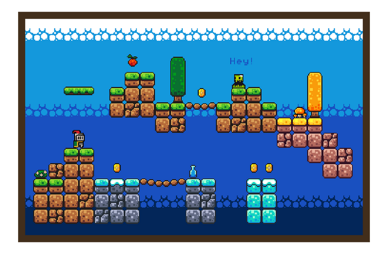

# jeanjacques-kathleen-tp2

L’idée du jeu est de contrôler un petit chevalier dans un monde de plateforme en 2D.
Le joueur peut marcher et sauter pour éviter les obstacles et ramasser des pièces dispersées dans le niveau.

Voici les assets utilisés : 

https://brackeysgames.itch.io/brackeys-platformer-bundle 

Et une image à ce à quoi cela peut ressembler : 

